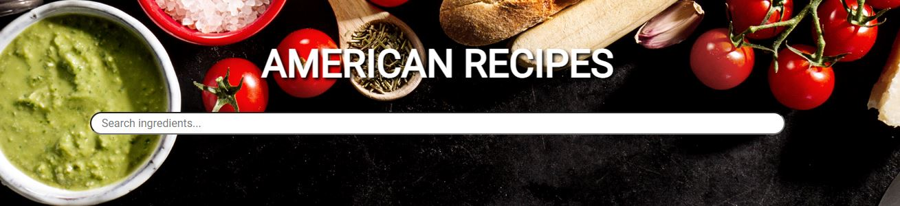

  <h1>Recipe search app</h1> 
  

<!-- ABOUT THE PROJECT -->
## About The Project
Recipe search by ingredients app with beautiful modern design

  

    <a href="https://american-recipe.glitch.me/">View Demo Here</a>
  

## Built With

[HTML5](https://www.w3schools.com/html/) / [CSS3](https://www.w3schools.com/css/) / [JavaScript](https://www.w3schools.com/js/)
 
<!-- USAGE EXAMPLES -->
## Usage
Recipe search application with a modern design. 
In the search bar, you must specify the ingredient and the application will find all recipes with it.
All recipes are taken from https://natashaskitchen.com/
You should definitely try them! It's so delicious!

All photo and video materials are used for educational purposes only.

Application is responsive for all mobile devices.

Project Link: https://github.com/kateFrontend/Recipe-search
